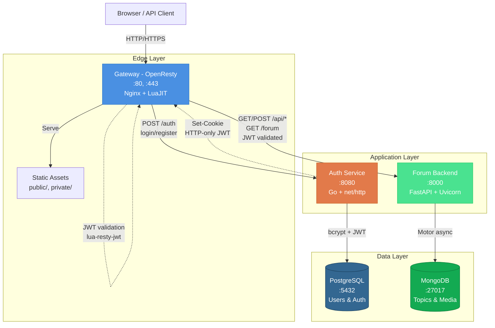
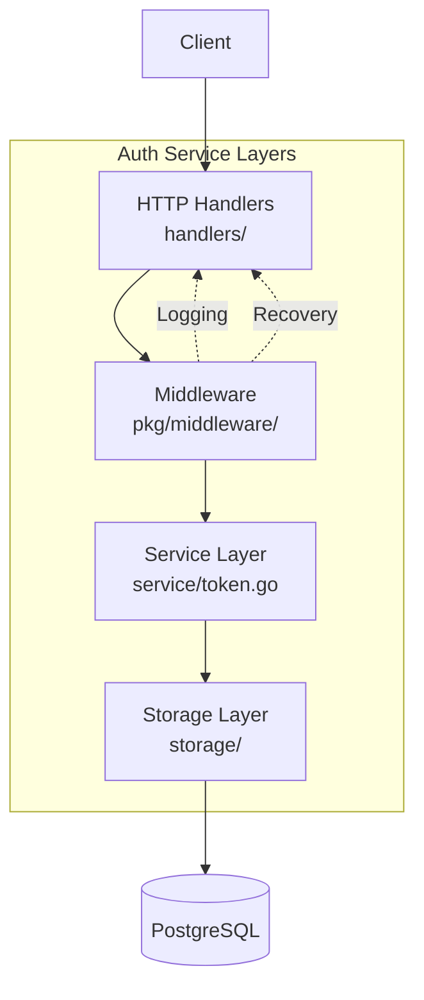
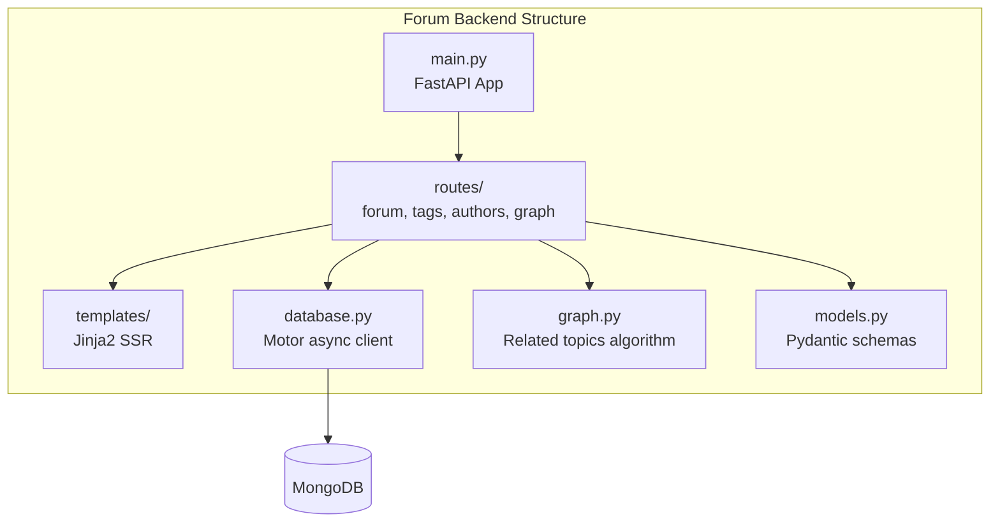
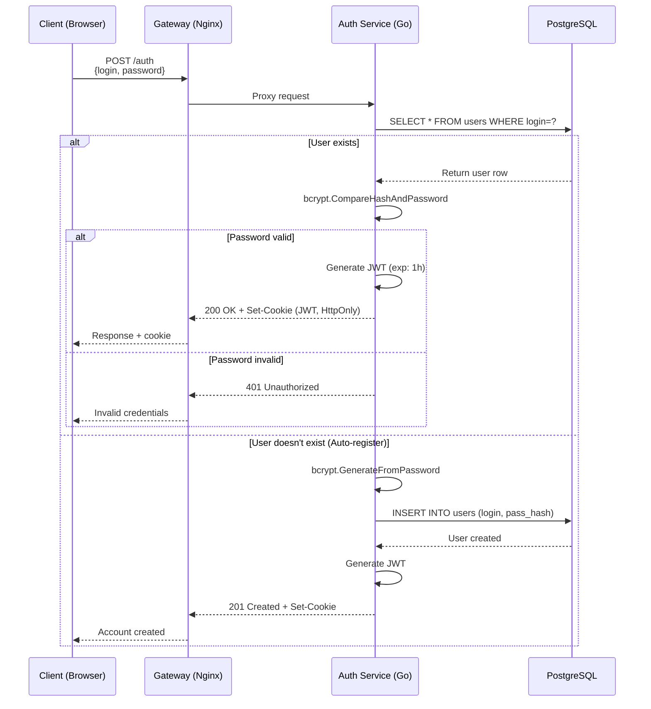
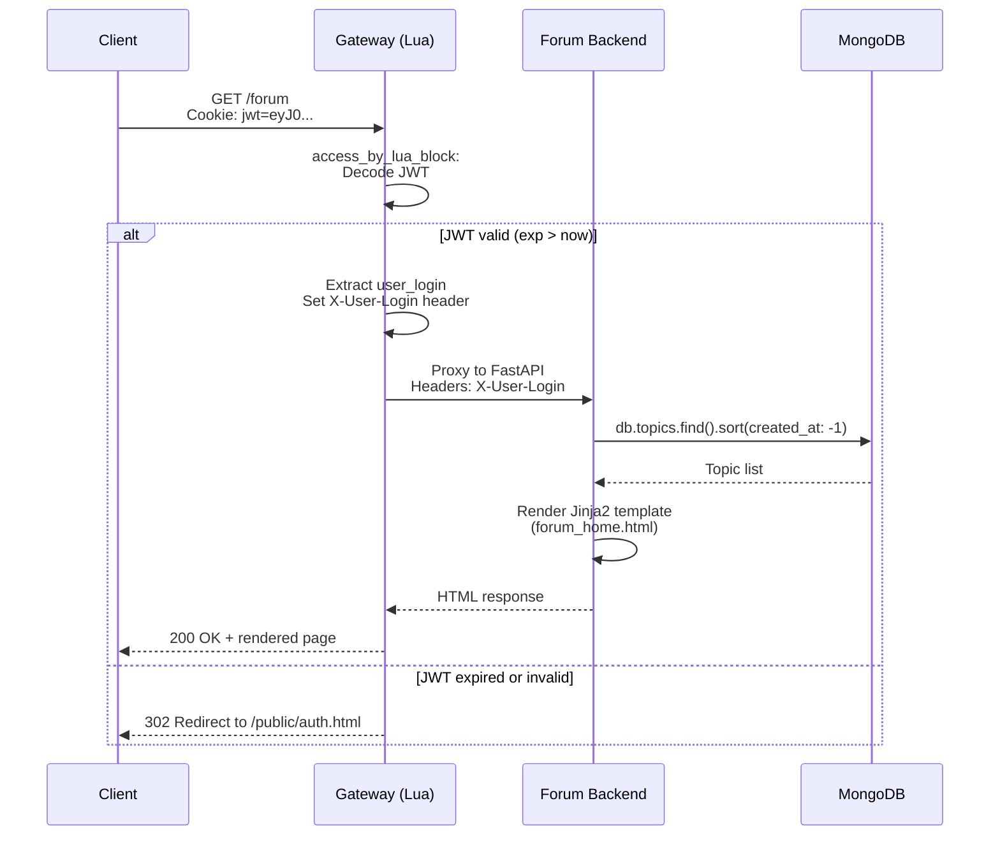
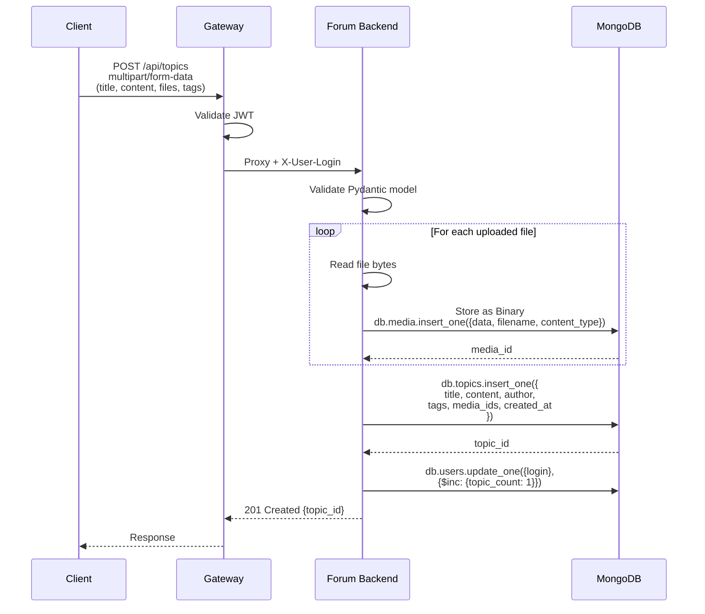
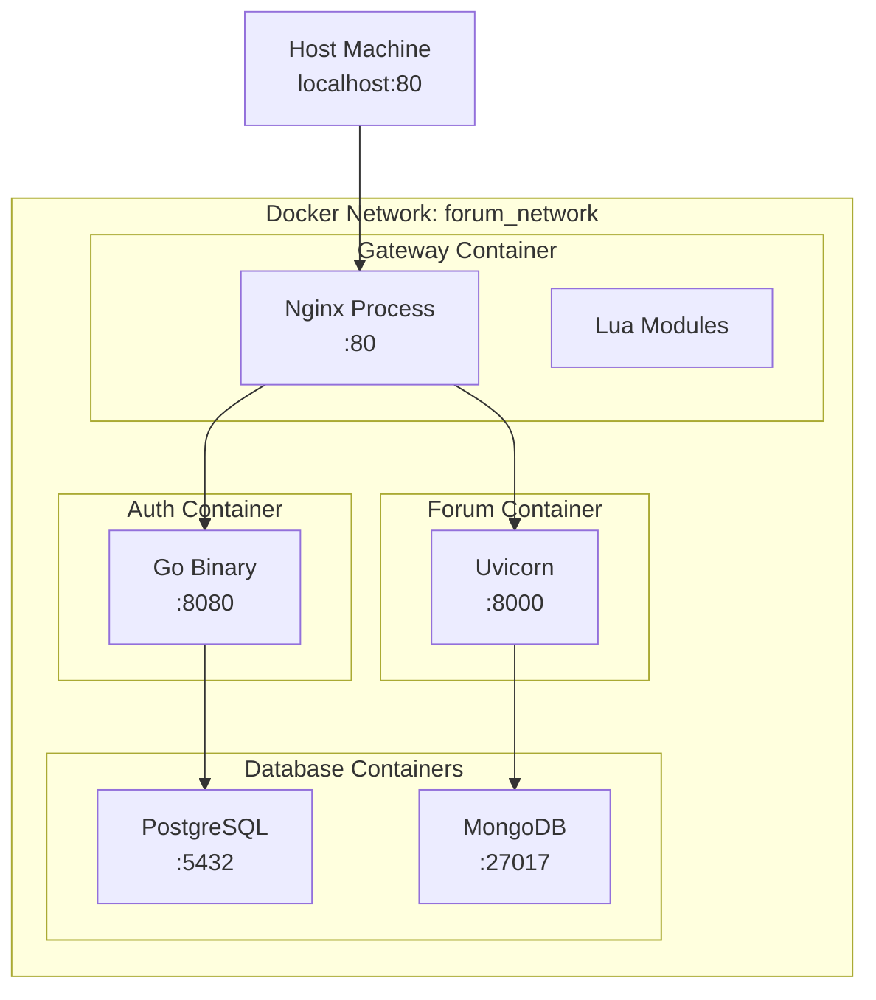

# Forum Platform — Microservice Architecture

Платформа представляет собой распределенную систему для создания высоконагруженных форумов и сообществ, построенную на микросервисной архитектуре с единой точкой входа через API Gateway (OpenResty + Lua), который обеспечивает маршрутизацию, JWT-валидацию и защиту от несанкционированного доступа. Система состоит из трех независимых сервисов: Auth Service на Go с PostgreSQL для управления идентификацией, Forum Backend на FastAPI с MongoDB для работы с контентом и медиа, и Gateway для проксирования трафика, что обеспечивает горизонтальное масштабирование, отказоустойчивость и возможность независимого развертывания компонентов.

## Обзор архитектуры

Платформа реализует паттерн **API Gateway + Backend for Frontend (BFF)** с централизованной аутентификацией через JWT и полиглотной персистенцией данных (PostgreSQL для транзакционных операций, MongoDB для документно-ориентированного хранения).

### Архитектура высокого уровня



### Принципы проектирования

**Разделение ответственности (Separation of Concerns)**

- **Edge Layer (Gateway):** Маршрутизация, JWT-валидация, статическая отдача, SSL termination, rate limiting
- **Application Layer:** Бизнес-логика без знания о сетевой топологии
- **Data Layer:** Полиглотная персистенция с оптимизацией под use-case

**Безопасность (Security in Depth)**

- JWT токены с HMAC-SHA256 подписью и ротацией ключей
- bcrypt с cost factor 10 для паролей
- HTTP-only cookies для защиты от XSS
- Lua-based JWT декодирование на уровне gateway (без обращения к backend)
- Минимальная поверхность атаки через reverse proxy

**Асинхронность и производительность**

- Асинхронная обработка в Forum через FastAPI + Motor (asyncio)
- Горутины в Auth Service для параллельных DB операций
- LuaJIT в Gateway для sub-millisecond JWT validation
- Connection pooling в PostgreSQL (HikariCP-style)

## Технологический стек

### Backend Services

| Компонент | Технология | Версия | Роль |
|-----------|-----------|--------|------|
| **API Gateway** | OpenResty (Nginx + LuaJIT) | 1.21+ | Reverse proxy, JWT validation, static serving |
| **Auth Service** | Go + net/http | 1.25 | User registration, authentication, JWT issuance |
| **Forum Backend** | Python + FastAPI | 3.11 / FastAPI 0.109+ | Topics, tags, media, search, SSR |
| **JWT Library** | lua-resty-jwt | Latest | Stateless token validation in Lua |

### Data Layer

| СУБД | Роль | Особенности |
|------|------|-------------|
| **PostgreSQL 15** | Auth storage | ACID, unique indexes on login, timestamped records |
| **MongoDB 7** | Forum content | JSONB-like storage, GridFS for media, text indexes |

### Security & Protocols

| Протокол/Техника | Применение |
|-----------------|-----------|
| **JWT (HMAC-SHA256)** | Stateless authentication между Gateway и Backend |
| **bcrypt** | Password hashing с cost factor 10 |
| **HTTP-only Cookies** | Secure token delivery, XSS protection |
| **TLS 1.2+** | Encrypted transport (production) |

### Infrastructure

| Технология | Применение |
|------------|-----------|
| **Docker** | Контейнеризация всех сервисов |
| **Docker Compose** | Локальная оркестрация (dev environment) |
| **Nginx Upstream** | Load balancing и health checks |

## Компоненты системы

### Gateway (OpenResty) — Edge Layer

Высокопроизводительный reverse proxy с программируемой логикой маршрутизации на Lua.

**Ключевые возможности:**

- **JWT Validation:** Декодирование и верификация токенов на уровне Nginx без обращения к backend (<1ms latency)
- **Route-based Authorization:** Публичные маршруты (`/public/*`, `/auth`) vs защищённые (`/forum`, `/api/*`)
- **Static Serving:** Разделение публичной (auth.html, reg.js) и приватной статики
- **Header Injection:** Передача `X-User-Login` в backend после валидации JWT
- **Graceful Degradation:** Автоматический редирект на `/public/auth.html` при истечении токена

**Файлы:**

- `gateway/nginx.conf` — конфигурация upstream, locations, Lua hooks
- `gateway/jwt-auth.lua` — модуль валидации JWT с проверкой exp/iat
- `gateway/jwt.lua` — базовая библиотека декодирования токенов
- `gateway/static_public/` — статические ресурсы (auth.html, favicon.ico, reg.js)

**Архитектурные паттерны:**

- **Backend for Frontend (BFF):** Gateway адаптирует внутренние API под нужды фронтенда
- **Circuit Breaker:** Nginx upstream конфиг с `max_fails` и `fail_timeout`
- **API Composition:** Единый endpoint `/api` проксирует множественные backend routes

### Auth Service (Go) — Identity Provider

Микросервис аутентификации построен на стандартной библиотеке Go (net/http) с чистой слоистой архитектурой.

**Архитектура:**



**Endpoints:**

- `POST /auth` — unified login/registration endpoint (auto-register if login doesn't exist)
- `GET /health` — health check для orchestration

**Технические детали:**

- **Password Hashing:** bcrypt.GenerateFromPassword с DefaultCost (10 rounds)
- **JWT Generation:** Claims с user_login, exp (1 hour), iat (issued at)
- **Database Abstraction:** Интерфейс `ManagerDB` для testability и future MySQL/SQLite support
- **Context Timeouts:** 5-секундные таймауты для всех DB операций
- **Structured Logging:** log/slog с JSON форматом для production

**Security Considerations:**

- Уникальный индекс на `login` предотвращает race conditions при регистрации
- bcrypt автоматически солит пароли (salt embedded в hash)
- JWT секрет читается из переменной окружения (не hardcoded)

### Forum Backend (FastAPI) — Content Management

Асинхронный backend на FastAPI с серверным рендерингом через Jinja2 Templates.

**Архитектура:**



**Функциональные модули:**

- **Topics Management:** CRUD операций для тем форума с автогенерацией slug
- **Tag System:** Иерархическая классификация контента с счётчиками использования
- **Media Upload:** Загрузка файлов с сохранением как MongoDB Binary (GridFS-style)
- **Graph Builder:** Алгоритм построения связей между темами по автору, тегам, keywords
- **Full-text Search:** MongoDB text indexes для поиска по содержимому

**Коллекции MongoDB:**

- `topics` — содержимое тем (title, content, author, tags, media, links)
- `users` — агрегированная статистика пользователей (topic_count, last_activity)
- `tags` — метаданные тегов (name, count, related_tags)

**Performance Optimizations:**

- Асинхронный драйвер Motor для non-blocking I/O
- Индексирование полей author, tags, created_at
- Pagination с limit/skip для больших списков
- Jinja2 template caching для повторяющихся страниц

## Потоки данных

### Authentication Flow (Login/Register)



### Authorized Request Flow (Forum Access)



### Topic Creation with Media Upload



## Развертывание

### Топология (Docker Compose)



### Структура репозитория

```text
forum-platform/
├── auth/                       # Go Auth Service
│   ├── cmd/app/main.go        # Entry point
│   ├── internal/
│   │   ├── handlers/          # HTTP handlers (auth, health, register)
│   │   ├── service/           # JWT token generation
│   │   └── storage/           # PostgreSQL abstraction
│   ├── pkg/
│   │   ├── middleware/        # Logger, recovery
│   │   └── reply.go           # HTTP response helpers
│   ├── Dockerfile
│   ├── docker-compose.yaml
│   └── docs/README.md
│
├── forum/                      # FastAPI Forum Backend
│   ├── app/
│   │   ├── main.py            # FastAPI app factory
│   │   ├── routes/            # Forum, tags, authors, graph stats
│   │   ├── templates/         # Jinja2 HTML templates
│   │   ├── database.py        # Motor async MongoDB client
│   │   ├── graph.py           # Related topics algorithm
│   │   └── models.py          # Pydantic schemas
│   ├── run.py                 # Uvicorn launcher
│   ├── Dockerfile
│   ├── docker-compose.yaml
│   ├── requirements.txt
│   └── docs/
│       ├── README.md
│       └── *.png              # Screenshots
│
├── gateway/                    # OpenResty API Gateway
│   ├── nginx.conf             # Nginx + Lua configuration
│   ├── jwt-auth.lua           # JWT validation module
│   ├── jwt.lua                # JWT decode library
│   ├── static_public/         # Public assets (auth.html, reg.js)
│   ├── Dockerfile
│   ├── docker-compose.yaml
│   └── README.md
│
└── README.md                   # This file
```

## Конфигурация

### Переменные окружения

**Auth Service:**

| Variable | Default | Description |
|----------|---------|-------------|
| `DB_HOST` | `postgres` | PostgreSQL host |
| `DB_PORT` | `5432` | PostgreSQL port |
| `DB_USER` | `postgres` | Database username |
| `DB_PASSWORD` | `postgres` | Database password |
| `DB_NAME` | `authdb` | Database name |
| `JWT_SECRET` | `changeme` | HMAC signing key |
| `JWT_EXPIRY` | `3600` | Token lifetime in seconds (1 hour) |
| `PORT` | `8080` | HTTP server port |

**Forum Backend:**

| Variable | Default | Description |
|----------|---------|-------------|
| `MONGO_HOST` | `mongodb` | MongoDB host |
| `MONGO_PORT` | `27017` | MongoDB port |
| `MONGO_DB` | `forumdb` | Database name |
| `UVICORN_PORT` | `8000` | HTTP server port |

**Gateway:**

| Variable | Default | Description |
|----------|---------|-------------|
| `AUTH_UPSTREAM` | `auth-service:8080` | Auth backend address |
| `FORUM_UPSTREAM` | `forum-backend:8000` | Forum backend address |
| `JWT_SECRET` | `changeme` | Same secret as Auth Service |

### Проверка работоспособности

```bash
# Health check Gateway
curl http://localhost/health

# Test Auth (register)
curl -X POST http://localhost/auth \
  -H "Content-Type: application/json" \
  -d '{"login":"testuser","password":"test123"}'

# Access Forum (will redirect if no JWT)
curl -L http://localhost/forum
```

## Безопасность

### Реализованные меры

- [x] JWT с HMAC-SHA256 и коротким TTL (1 час)
- [x] bcrypt для паролей (cost factor 10)
- [x] HTTP-only cookies (защита от XSS)
- [x] Уникальные индексы (защита от race conditions)
- [x] Context timeouts (защита от DoS)
- [x] Middleware recovery (устойчивость к паникам)

## Мониторинг и метрики

### Доступные эндпоинты

- `GET /health` (Auth Service) — Kubernetes liveness probe
- `GET /health` (Forum Backend) — FastAPI health check
- Nginx status page — `stub_status` модуль

### Логирование

- **Auth:** JSON structured logs (log/slog)
- **Forum:** Uvicorn access logs + Python logging
- **Gateway:** Nginx access.log + error.log

## Лицензия

MIT License
